# Lab 01 Report - Introduction to Open Source Software

## Reading Assignments
**7. Smart Questions**
* If you figure out the solution to your issue on your own, please post the solution in your thread so that others with your problem in the future can have the solution as well, don't just say "nvm fixed it!".
* Don't have a god-complex and assume that everyone knows whats going on inside your head, they will only know the information you provide in your thread. Cooperate with those trying to answer your question and provide additional information as requested. Etiquette applies to you as well, not just helpers.

**8. Free Culture**

What I got out of reading that chapter is that you have to be careful about what you create, because it may be used for an unintended purpose and land you in a lot of trouble. Jesse likely created his directory search tool to better connect RPI to resources available within the university, not even considering that it could be used for media sharing. He unintentionally created a P2P tool that could be used for piracy and even though it was a mistake he still had to pay the consequences. When creating software with a wide range of uses such as this, one must consider all the purposes it could be used for. One way that Jesse could have avoided this would be to disallow the indexing of media files (.mp3, .wav, .mp4, .mov, etc.) or rather than blacklisting certain file types only whitelisting certain file types to be indexed. The unfortunate truth is that you must suffer the consequences of your actions, even if those actions had good intentions.

## Linux
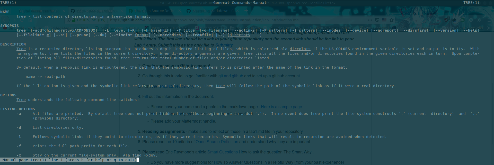

## Regex
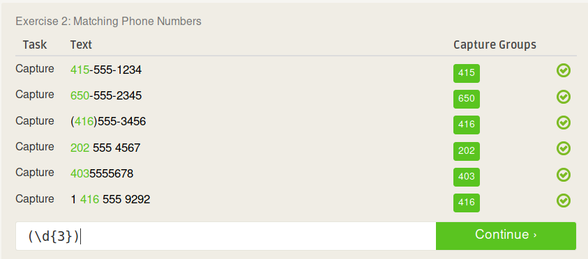
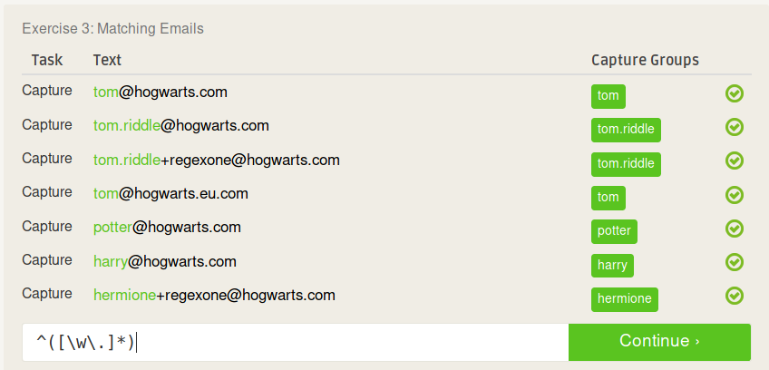
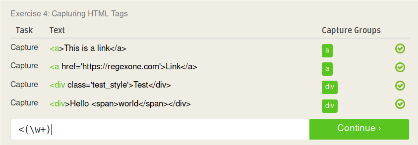

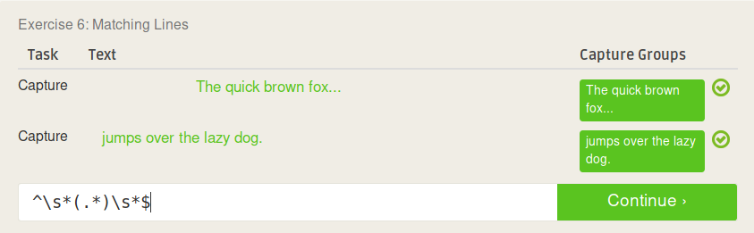
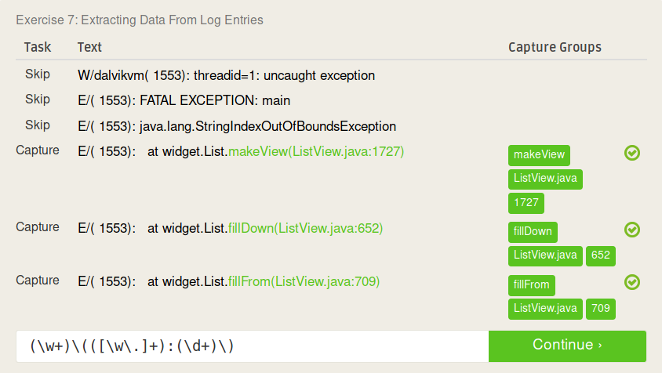
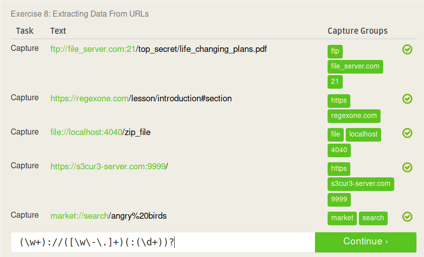

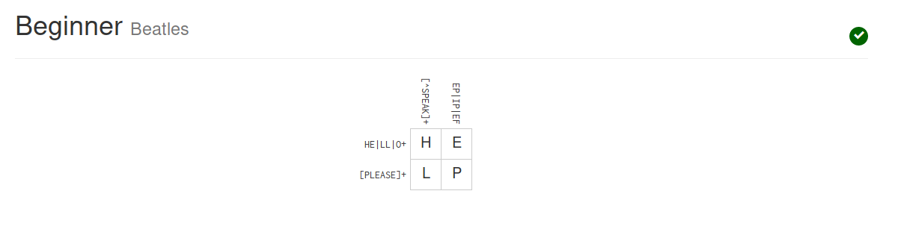
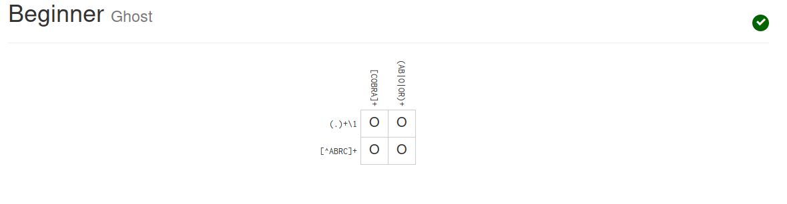
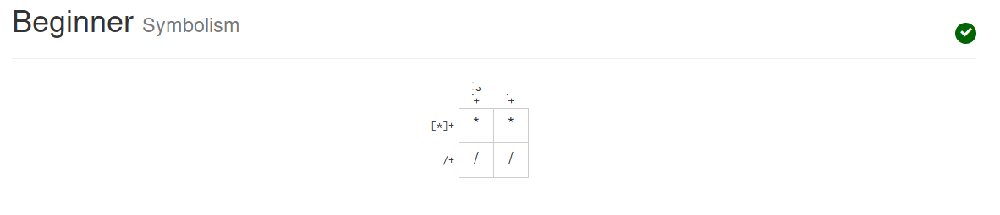
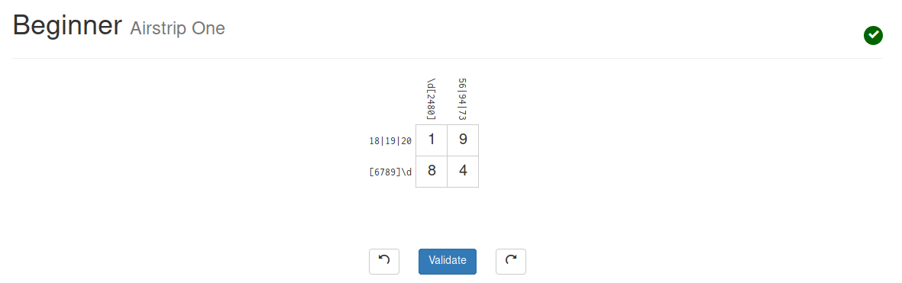

## Blockly
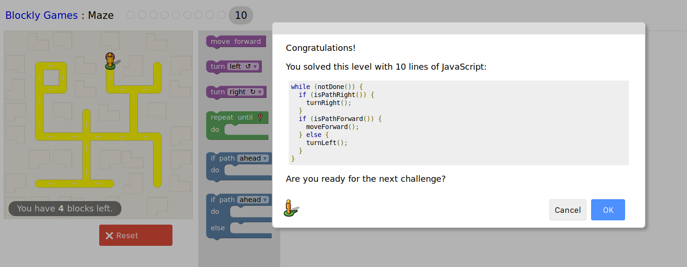

## Reflection