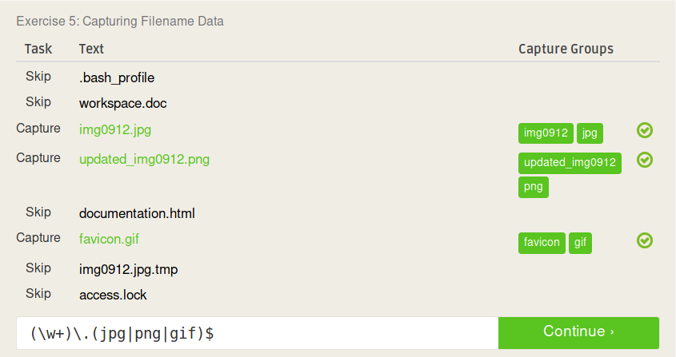

# Lab 01 Report - Introduction to Open Source Software

## Reading Assignments
**7. Smart Questions**
* If you figure out the solution to your issue on your own, please post the solution in your thread so that others with your problem in the future can have the solution as well, don't just say "nvm fixed it!".
* Don't have a god-complex and assume that everyone knows whats going on inside your head, they will only know the information you provide in your thread. Cooperate with those trying to answer your question and provide additional information as requested. Etiquette applies to you as well, not just helpers.

**8. Free Culture**

What I got out of reading that chapter is that you have to be careful about what you create, because it may be used for an unintended purpose and land you in a lot of trouble. Jesse likely created his directory search tool to better connect RPI to resources available within the university, not even considering that it could be used for media sharing. He unintentionally created a P2P tool that could be used for piracy and even though it was a mistake he still had to pay the consequences. When creating software with a wide range of uses such as this, one must consider all the purposes it could be used for. One way that Jesse could have avoided this would be to disallow the indexing of media files (.mp3, .wav, .mp4, .mov, etc.) or rather than blacklisting certain file types only whitelisting certain file types to be indexed. The unfortunate truth is that you must suffer the consequences of your actions, even if those actions had good intentions.

## Linux

## Regex

## Blockly

## Reflection
* A project that I think might be interesting to evaluate would be [Get5 by splewis](https://github.com/splewis/get5/), a CS:GO Sourcemod plugin for competitive matches/scrims. 
* A project that interests me wuld be a tool for gamers that recommends games for you based off of the games that you own and how much time that you've played them, and using those games' tags or other information available to suggest new games. If you're looking for a change of pace from the games that you usually play, the tool could do the opposite and recommend maybe a game that you own and haven't played a lot or an entirely new game that doesn't match any of the tags of your favorite games. The tool could have the option to select price range as well for these new games so you could perhaps look for cheap/free games that match your criteria only. And even if it can't find a perfect match, it could still suggest others and display information on how the tool chose its selections for recommendation. Tool would likely be primarily based off of the Steam API on PC, but additional APIs could consider other vendors such as GOG, Epic Games, or additional platforms such as Xboox or Playstation.