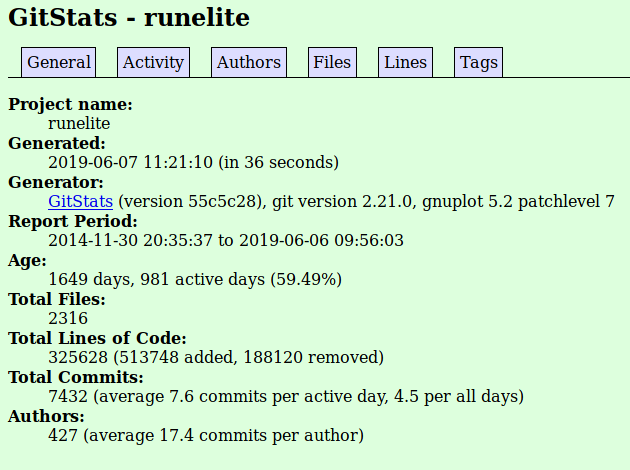
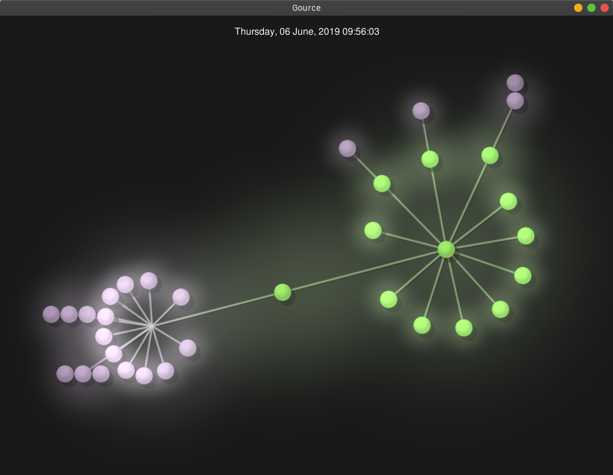
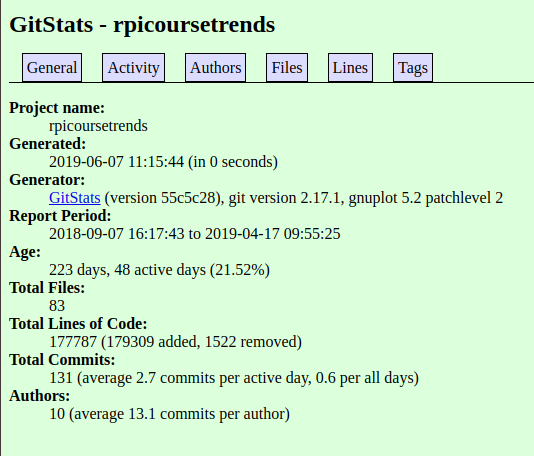
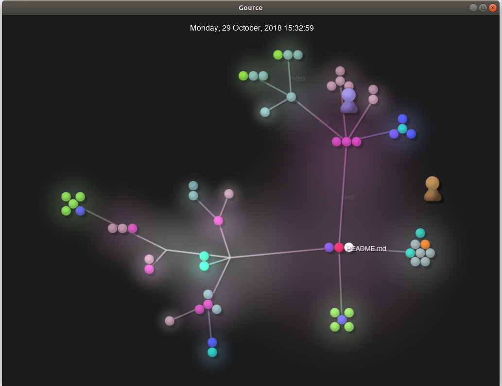
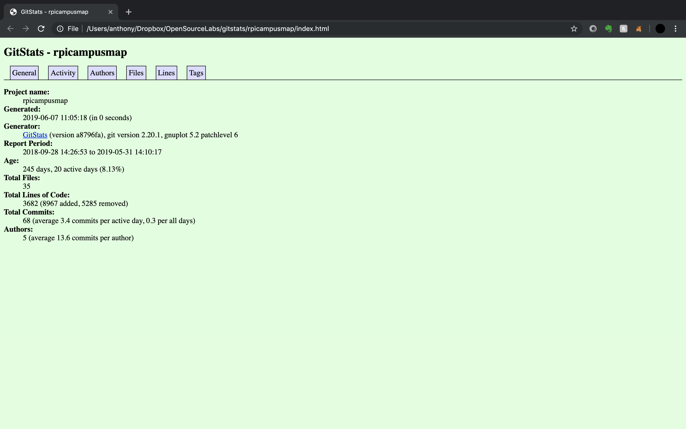
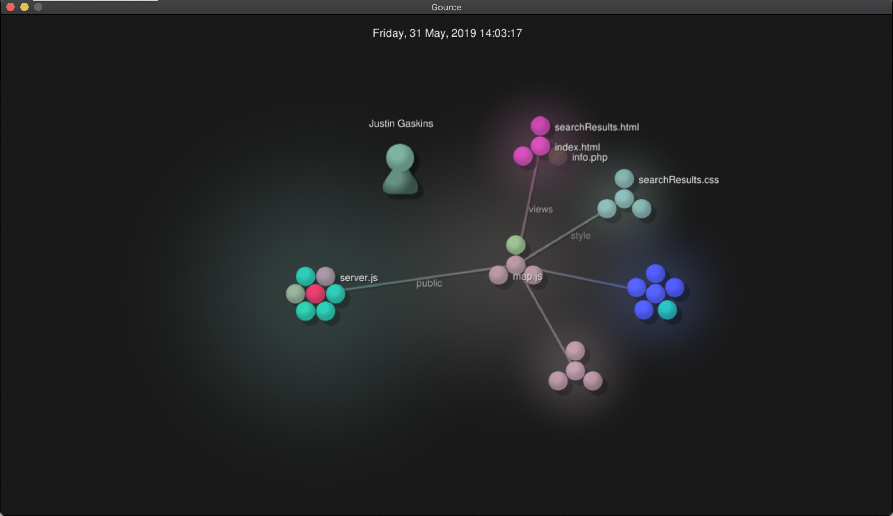
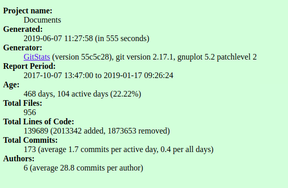

# Lab 03 Report - Documentation and Community

## Part 1

## Part 2
### My pieces
I looked at (https://rcos.io/projects/runelite/runelite/profile/)[https://rcos.io/projects/runelite/runelite/profile/] stats as of 6/7/19 11:07 AM

* Number of contributers: 334
* Number of lines of code: 48074
* First commit: 6/6/2019 9:56 PM
* Latest commit: 11/30/2014 8:35 PM
* Current branches: master

*It should be noted that this is not the full gource tree for this repo, as the full tree would take around 6 hours to generate at over 250GB of ppm footage.*

Gitstats differs from information obtained by looking at Github repository and running the `git ls-files -z | xargs -0 wc -l` command, number of contributors increased to 427 from 334, lines of code increased to 325628 from 48074.

### Groupmates' pieces
#### Griffin Smith
RPI Campus Trends Repo Data:

* Number of Contributors: 5
* Lines of Code: 181,974
* First Commit: 9/2/18
* Last Commit: 4/17/19
* Current Branches: 2 (master and flask-refractor)

---
#### Anthony Chen
RPI Campus Map

* Number of contributors: 4
* Number of lines of code: 18198
* First commit: Sep 28, 2018
* Latest commit: Mar 26, 2019 
* Current branches: 5 (master, forgemill-dev, forgemill, dev, production)

---
#### James Berry
RushMeiOS

* Contributors: 3
* Lines of code: 549,515
* First commit: Sat Oct 7 13:47:00 2017
* Last commit: Thu Jan 17 09:26:24 2019
* Branches: 11 (Cam, Chat, ErrorSystem, NewLook, Notifications, SaveFrats, calendar, changes-jim, favorites, linted-version, master)

