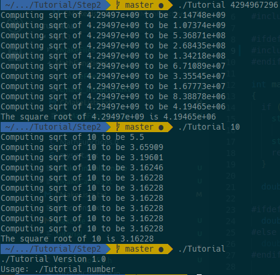
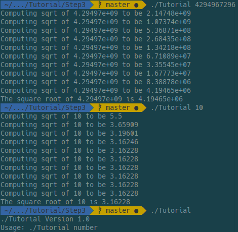

# Lab 05 Report - Build Systems


**1.** 

`tutorial.cxx`
```c++
// A simple program that computes the square root of a number
#include <cmath>
#include <cstdlib>
#include <iostream>
#include <string>

#include "TutorialConfig.h"

int main(int argc, char* argv[])
{
  if (argc < 2) {
    std::cout << "Usage: " << argv[0] << " number" << std::endl;
    return 1;
  }

  double inputValue = std::stod(argv[1]);

  double outputValue = sqrt(inputValue);
  std::cout << "The square root of " << inputValue << " is " << outputValue
            << std::endl;
  return 0;
}
```

`CMakeLists.txt`
```cmake
cmake_minimum_required(VERSION 3.3)
project(Tutorial)

set(Tutorial_VERSION_MAJOR 1)
set(Tutorial_VERSION_MINOR 0)
set(CMAKE_CXX_STANDARD 11)
set(CMAKE_CXX_STANDARD_REQUIRED True)

configure_file(
  "${PROJECT_SOURCE_DIR}/TutorialConfig.h.in"
  "${PROJECT_BINARY_DIR}/TutorialConfig.h"
)

add_executable(Tutorial tutorial.cxx)

target_include_directories(Tutorial PUBLIC
                          "${PROJECT_BINARY_DIR}"
                          )
```


**2.** 

`tutorial.cxx`
```c++
// A simple program that computes the square root of a number
#include <cmath>
#include <iostream>
#include <string>

#include "TutorialConfig.h"

#ifdef USE_MYMATH
#include "MathFunctions.h"
#endif

int main(int argc, char* argv[])
{
  if (argc < 2) {
    std::cout << argv[0] << " Version " << Tutorial_VERSION_MAJOR << "."
              << Tutorial_VERSION_MINOR << std::endl;
    std::cout << "Usage: " << argv[0] << " number" << std::endl;
    return 1;
  }

  double inputValue = std::stod(argv[1]);

  #ifdef USE_MYMATH
    double outputValue = mysqrt(inputValue);
  #else
    double outputValue = sqrt(inputValue);
  #endif
  std::cout << "The square root of " << inputValue << " is " << outputValue
            << std::endl;
  return 0;
}
```

`CMakeLists.txt`
```cmake
cmake_minimum_required(VERSION 3.3)
project(Tutorial)

set(CMAKE_CXX_STANDARD 14)

# the version number.
set(Tutorial_VERSION_MAJOR 1)
set(Tutorial_VERSION_MINOR 0)

# configure a header file to pass some of the CMake settings
# to the source code
configure_file(
  "${PROJECT_SOURCE_DIR}/TutorialConfig.h.in"
  "${PROJECT_BINARY_DIR}/TutorialConfig.h"
  )

# should we use our own math functions
option(USE_MYMATH "Use tutorial provided math implementation" ON)

# add the MathFunctions library?
if(USE_MYMATH)
  add_subdirectory(MathFunctions)
  list(APPEND EXTRA_LIBS MathFunctions)
  list(APPEND EXTRA_INCLUDES "${PROJECT_SOURCE_DIR}/MathFunctions")
endif(USE_MYMATH)

# add the executable
add_executable(Tutorial tutorial.cxx)

target_link_libraries(Tutorial ${EXTRA_LIBS})

# add the binary tree to the search path for include files
# so that we will find TutorialConfig.h
target_include_directories(Tutorial PUBLIC
                            "${PROJECT_BINARY_DIR}"
                            ${EXTRA_INCLUDES}
                            )
```


**3.**

`CMakeLists.txt`
```cmake
cmake_minimum_required(VERSION 3.3)
project(Tutorial)

set(CMAKE_CXX_STANDARD 14)

# should we use our own math functions
option(USE_MYMATH "Use tutorial provided math implementation" ON)

# the version number.
set(Tutorial_VERSION_MAJOR 1)
set(Tutorial_VERSION_MINOR 0)

# configure a header file to pass some of the CMake settings
# to the source code
configure_file(
  "${PROJECT_SOURCE_DIR}/TutorialConfig.h.in"
  "${PROJECT_BINARY_DIR}/TutorialConfig.h"
  )

# add the MathFunctions library?
if(USE_MYMATH)
  add_subdirectory(MathFunctions)
  list(APPEND EXTRA_LIBS MathFunctions)
endif(USE_MYMATH)

# add the executable
add_executable(Tutorial tutorial.cxx)

target_link_libraries(Tutorial PUBLIC ${EXTRA_LIBS})

# add the binary tree to the search path for include files
# so that we will find TutorialConfig.h
target_include_directories(Tutorial PUBLIC
                           "${PROJECT_BINARY_DIR}"
                           )
```

`MathFunctions/CMakeLists.txt
```cmake
add_library(MathFunctions mysqrt.cxx)

target_include_directories(MathFunctions
        INTERFACE ${CMAKE_CURRENT_SOURCE_DIR})

```

