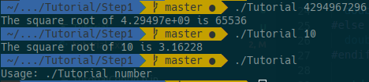

# Lab 05 Report - Build Systems

**1.** 

tutorial.cxx
```c++
// A simple program that computes the square root of a number
#include <cmath>
#include <cstdlib>
#include <iostream>
#include <string>

#include "TutorialConfig.h"

int main(int argc, char* argv[])
{
  if (argc < 2) {
    std::cout << "Usage: " << argv[0] << " number" << std::endl;
    return 1;
  }

  double inputValue = std::stod(argv[1]);

  double outputValue = sqrt(inputValue);
  std::cout << "The square root of " << inputValue << " is " << outputValue
            << std::endl;
  return 0;
}
```

CMakeLists.txt
```cmake
cmake_minimum_required(VERSION 3.3)
project(Tutorial)

set(Tutorial_VERSION_MAJOR 1)
set(Tutorial_VERSION_MINOR 0)
set(CMAKE_CXX_STANDARD 11)
set(CMAKE_CXX_STANDARD_REQUIRED True)

configure_file(
  "${PROJECT_SOURCE_DIR}/TutorialConfig.h.in"
  "${PROJECT_BINARY_DIR}/TutorialConfig.h"
)

add_executable(Tutorial tutorial.cxx)

target_include_directories(Tutorial PUBLIC
                          "${PROJECT_BINARY_DIR}"
                          )
```

