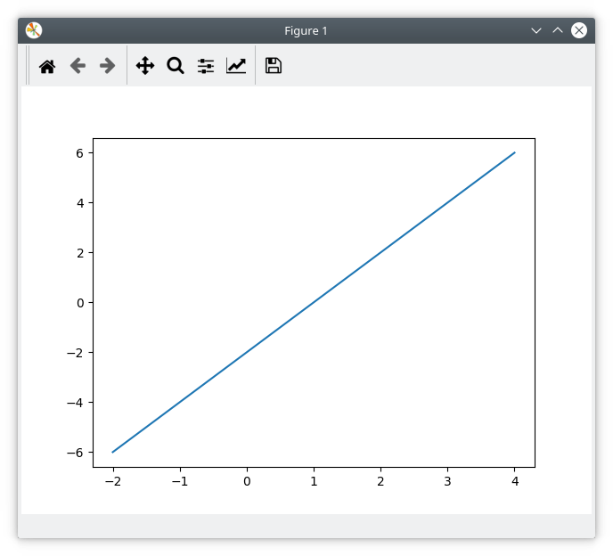
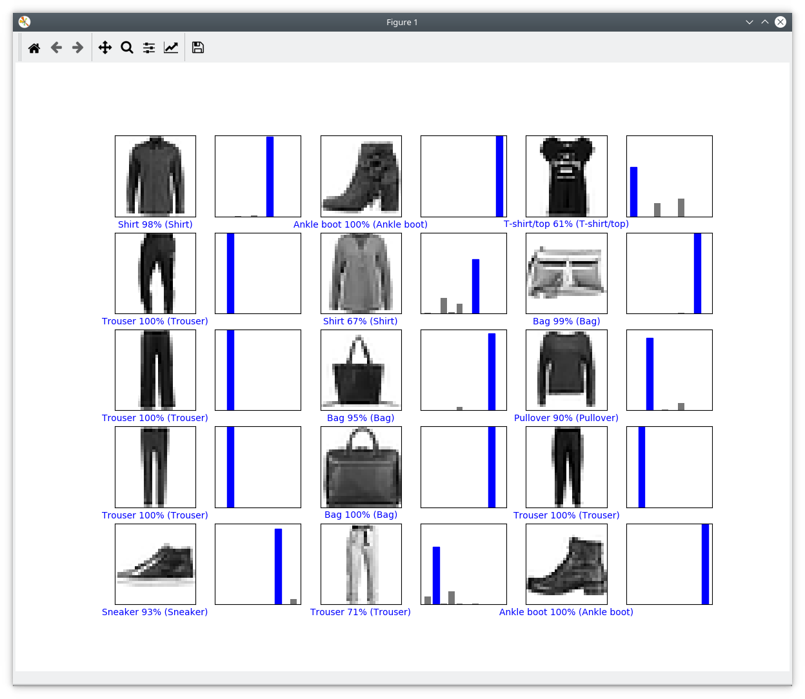
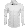
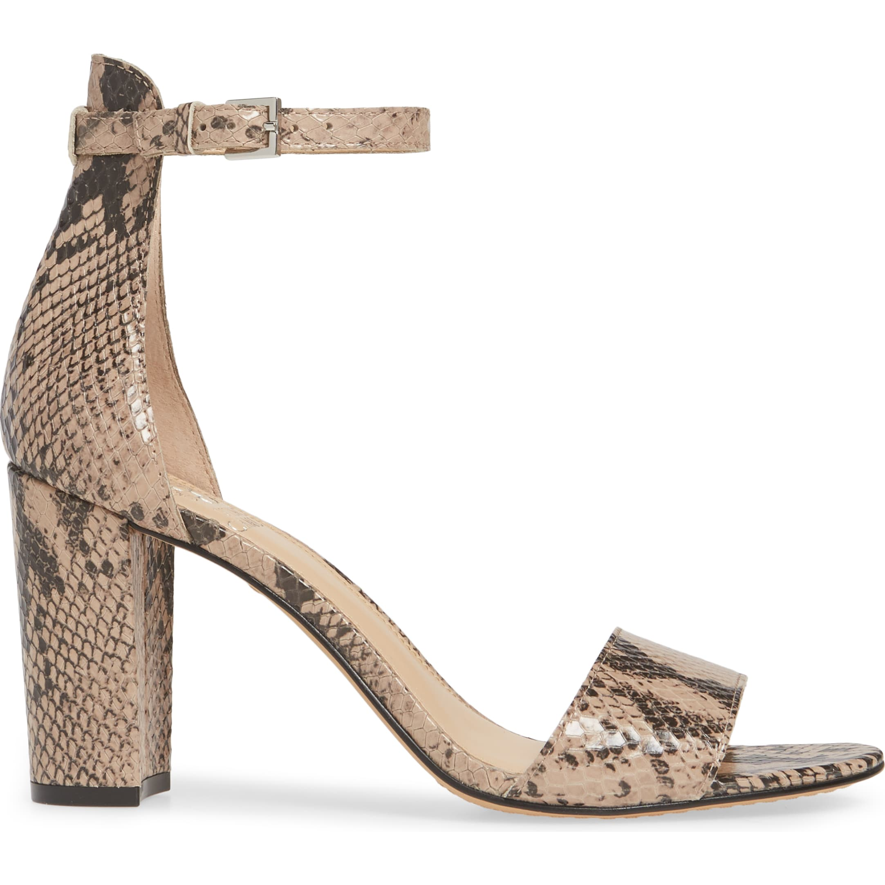
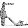
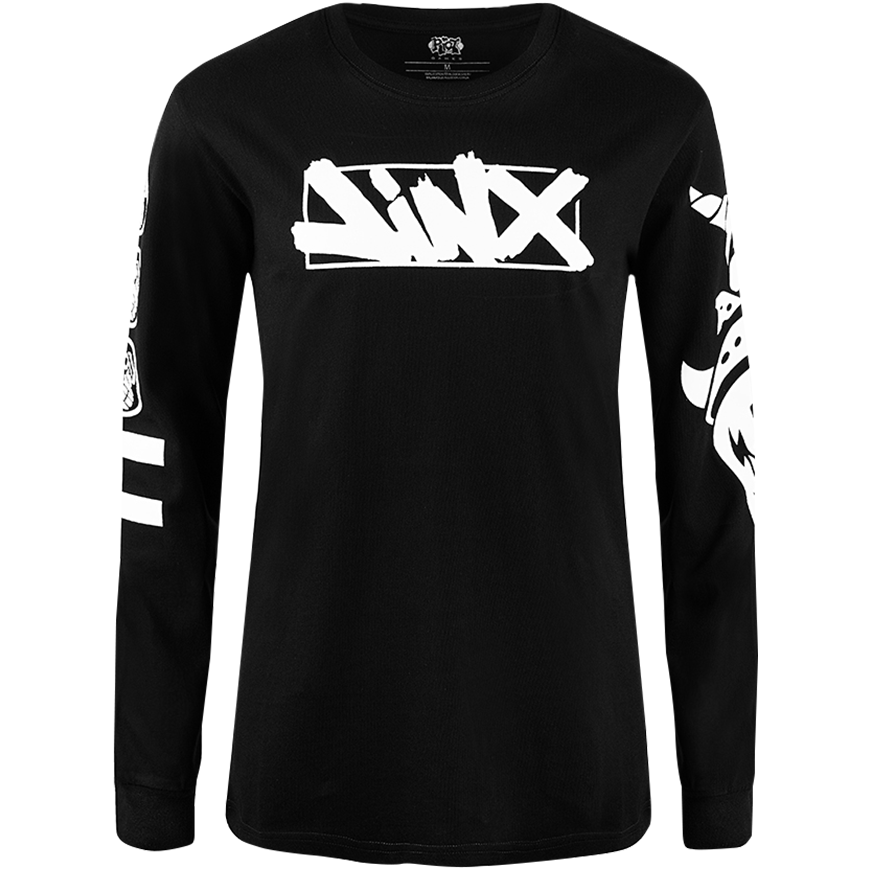
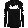

# Lab 09 Report - TensorFlow


## Checkpoint 1


## Checkpoint 2


## Checkpoint 3



```
[2.5846992e-02 1.3415913e-04 4.4610761e-02 7.6587908e-03 4.3779109e-02
 1.6400965e-03 8.7093121e-01 4.1559094e-04 4.9065766e-03 7.6590863e-05] 6 Shirt
```




```
[2.1109274e-01 5.0703585e-03 2.4816981e-02 5.3389376e-04 1.9899332e-03
 4.0668827e-03 2.7311578e-02 9.9715381e-04 7.2262084e-01 1.4995550e-03] 8 Bag
```




```
[2.7744570e-03 2.2966223e-08 9.9439842e-01 7.2004957e-05 1.4526104e-04
 7.0261349e-14 2.6089263e-03 5.1944538e-13 7.7931242e-07 3.2649846e-13] 2 Pullover
```

The neural network is able to correctly identify the first image as a shirt. It incorrectly identifies the 2nd image as a bag or sometimes as a t-shirt/top when it is a sandal or an ankle boot. It incorrectly identifies the 3rd image as a pullover when it is a shirt.
